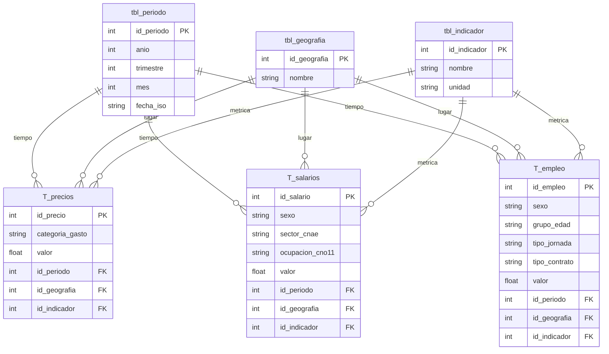

# 📈 Análisis de la Evolución del Poder Adquisitivo en España

## 🎯 Objetivo del Proyecto

El objetivo principal de este proyecto es analizar la evolución del poder adquisitivo de la clase trabajadora en España mediante un sistema automatizado de **Ingeniería de Datos**.

El proyecto implementa un proceso **ETL (Extract, Transform, Load)** que recopila, limpia y cruza datos macroeconómicos clave para establecer relaciones entre:
1.  **Calidad del empleo** (Tasa de paro y temporalidad).
2.  **Remuneración real** (Salarios de coyuntura y estructurales).
3.  **Coste de vida** (Inflación IPC y precio de la vivienda IPV).

El sistema permite desglosar la información por **Comunidades Autónomas**, sectores de actividad y grupos socioeconómicos, superando el análisis de medias simples.

---

## 📊 Fuentes de Datos (INE - API JSON-stat)

El proyecto se alimenta de fuentes oficiales del **Instituto Nacional de Estadística (INE)** mediante peticiones automatizadas a su API. A continuación se enlazan las tablas originales utilizadas:

### 1. Gasto y Coste de Vida
* **[IPC - Índice de Precios de Consumo (Tabla 50913)](https://www.ine.es/jaxiT3/Tabla.htm?t=50913):** Se extrae el índice general, variación anual y categorías clave (Alimentos, Transporte, Energía) para medir la inflación real.
* **[IPV - Índice de Precios de Vivienda (Tabla 25171)](https://www.ine.es/jaxiT3/Tabla.htm?t=25171):** Evolución del precio de compra de vivienda (Índice general y variación anual).

### 2. Ingresos y Salarios
* **[ETCL - Encuesta Trimestral de Coste Laboral (Tabla 6061)](https://www.ine.es/jaxiT3/Tabla.htm?t=6061):** Datos trimestrales sobre el *Coste Salarial* bruto (filtrando costes de seguridad social).
* **EAES - Encuesta Anual de Estructura Salarial:** Datos estructurales para medir la desigualdad.
    * *[Ganancia por trabajador (Tabla 28191)](https://www.ine.es/jaxiT3/Tabla.htm?t=28191):* Media, Mediana, Deciles 10 y Cuartil inferior.
    * *[Ganancia por ocupación (Tabla 28186)](https://www.ine.es/jaxiT3/Tabla.htm?t=28186):* Salarios desglosados por tipo de trabajo.

### 3. Empleo
* **[EPA - Tasa de Paro (Tabla 65334)](https://www.ine.es/jaxiT3/Tabla.htm?t=65334):** Tasa de paro (desglosada por sexo y edad).
* **[Asalariados por tipo de contrato (Tabla 65132)](https://www.ine.es/jaxiT3/Tabla.htm?t=65132):** Datos de asalariados totales vs. temporales (filtrados por jornada total) para calcular la tasa de temporalidad real.

---

## 🗄️ Arquitectura de Datos (Star Schema)

Se ha diseñado una base de datos **SQLite3** siguiendo un **Modelo en Estrella (Star Schema)**. Esta arquitectura separa las *dimensiones* (tablas de búsqueda) de las *tablas de hechos* (datos numéricos), optimizando el análisis posterior.

### Estructura Relacional
La base de datos se organiza en torno a tres tablas centrales de hechos que comparten las mismas dimensiones para facilitar el cruce de datos:

**Tablas de Dimensiones (Lookups):**
* **`tbl_periodo`**: Tabla maestra de tiempo. Normaliza frecuencias mensuales (IPC), trimestrales (EPA) y anuales (EES).
* **`tbl_geografia`**: Comunidades Autónomas y Total Nacional.
* **`tbl_indicador`**: Catálogo unificado de variables (ej: "IPC_General", "Salario_Mediana", "Tasa_Paro").

**Tablas de Hechos (Facts):**
| Tabla | Descripción | Desglose / Segmentación |
| :--- | :--- | :--- |
| **`T_precios`** | Unifica IPC e IPV. | `categoria_gasto` (Alimentos, Vivienda...) |
| **`T_salarios`** | Unifica ETCL y EES. | `sector_cnae`, `ocupacion_cno11`, `sexo` |
| **`T_empleo`** | Unifica Paro y Temporalidad. | `grupo_edad`, `tipo_contrato`, `tipo_jornada` |



---

## ⚙️ Arquitectura y Flujo del Proceso ETL

Este proyecto se ha construido siguiendo una arquitectura modular y orientada a objetos (OOP), diseñada para facilitar el mantenimiento, la escalabilidad y la trazabilidad del dato.

### 1. Estructura de Ficheros
El código se organiza separando claramente la configuración, la lógica de negocio y el acceso a datos:

```text
📁 Proyecto
├── 📄 main.py            # Orquestador: Inicia conexión y ejecuta el bucle ETL.
├── 📁 config
│   └── 📄 constantes.py  # Códigos ID de las tablas API del INE.
├── 📁 src
│   ├── 📄 db.py          # Patrón Singleton para conexión y creación de esquema.
│   ├── 📄 inedata.py     # EXTRACT: Clase para conexión HTTP y descarga JSON.
│   ├── 📄 procesar.py    # TRANSFORM: Limpieza, filtrado y lógica de negocio.
│   └── 📄 almacenar.py   # LOAD: Inserción masiva con control de duplicados.
└── 📄 proyecto_datos.db  # Base de datos resultante.
```


### 2. Detalle del Proceso ETL

El núcleo del proyecto es un pipeline automatizado que gestiona el ciclo de vida de los datos desde la API del INE hasta la base de datos analítica. El proceso se divide en tres etapas controladas por el orquestador `main.py`:

#### 1. Extracción (`src/inedata.py`)
* Conexión HTTP robusta con la API **JSON-stat** del INE.
* Gestión de errores de conexión y tiempos de espera (timeout).
* Descarga de series temporales completas en formato crudo (raw data).

#### 2. Transformación (`src/procesar.py`)
Es la etapa más compleja, donde se aplica la lógica de negocio para asegurar la calidad del dato:
* **Parsing de Metadatos:** Se descomponen las cadenas de texto del INE (ej: *"Total Nacional. Industria. Coste..."*) para extraer dimensiones limpias (Geografía, Sector, Sexo).
* **Filtrado de Salarios:** Se discrimina entre *"Coste Laboral"* y *"Coste Salarial"*, conservando únicamente este último (salario bruto) para reflejar la remuneración real del trabajador.
* **Lógica de Empleo:** Se filtran los datos de jornada parcial para calcular la **Temporalidad** basándose exclusivamente en contratos de jornada completa (comparando *Total Asalariados* vs *Temporales*).
* **Normalización del IPC:** Se agrupan y renombran las categorías de gasto (Alimentos, Vivienda, Transporte) para facilitar consultas SQL posteriores.

#### 3. Carga (`src/almacenar.py`)
* **Enrutamiento Inteligente:** El sistema detecta automáticamente a qué tabla de hechos (`T_precios`, `T_salarios`, `T_empleo`) deben ir los datos según su código de origen.
* **Gestión de Integridad:** Uso de sentencias `INSERT OR IGNORE` combinadas con claves únicas compuestas (`UNIQUE`) en la base de datos. Esto permite re-ejecutar el script tantas veces como sea necesario sin generar registros duplicados.

---

## 🚀 Instalación y Uso

Sigue estos pasos para desplegar el proyecto en tu entorno local:

### 1. Clonar el repositorio
Descarga el código fuente desde GitHub:
```bash
git clone https://github.com/Alebernabe5/Act1.7-ObtencionYAlmacenamiento
cd Act1.7-ObtencionYAlmacenamiento
```

### 2. Configurar el entorno virtual
Es recomendable usar un entorno virtual para aislar las dependencias:
* **En macOS / Linux**:
    ```bash
    python3 -m venv .venv
    source .venv/bin/activate
    ```
* **En Windows**:
    ```bash
    python -m venv .venv
    .venv\Scripts\activate
    ```

### 3. Instalar dependencias
El proyecto es ligero y solo requiere la librería `requests` para las peticiones a la API:
```bash
pip install requests
```

### 4. Ejecutar el ETL
Lanza el script principal. No es necesario configurar la base de datos previamente; el script la creará si no existe.
```bash
python main.py
```

**Resultado esperado:** Verás en la terminal el progreso de procesamiento tabla por tabla. Al finalizar, se habrá generado un archivo `proyecto_datos.db` en la raíz del proyecto con todos los datos actualizados.

---

# 🚀 Fase 2: Procesamiento Big Data y Análisis Visual

En esta segunda etapa, hemos evolucionado el sistema hacia un entorno de **Big Data**, migrando el procesamiento de datos a **Polars** para ganar eficiencia y generando una capa de visualización interactiva.

## 🛠️ Nuevas Tecnologías Implementadas
* **Polars**: Motor de procesamiento de datos ultra rápido escrito en Rust, utilizado para el manejo de grandes volúmenes de datos mediante ejecución paralela.
* **Plotly**: Librería para la creación de gráficos interactivos que permiten una exploración dinámica de los indicadores.
* **ConnectorX**: Motor de alta velocidad para la extracción de datos desde SQLite hacia dataframes de Polars.

## 📊 Pipeline de Análisis Big Data (`analisis_bigdata2.py`)

El nuevo script implementa un flujo avanzado de datos:

1.  **Carga Optimizada**: Extracción de las tablas de hechos (`T_precios`, `T_salarios`, `T_empleo`) unificando dimensiones mediante SQL JOINs directos en la carga.
2.  **Transformación y Limpieza**:
    * Conversión de tipos de datos y manejo de valores nulos mediante expresiones vectorizadas de Polars.
    * **Cruce de Indicadores (Joins)**: Unión de la tabla de IPC con la de Salarios para permitir el cálculo de ratios en la misma serie temporal.
3.  **Columnas Calculadas (Ingeniería de Características)**:
    * **Ratio de Poder Adquisitivo**: Cálculo del índice $Salario / IPC$ para medir la ganancia o pérdida de valor real de los sueldos.

## 📂 Arquitectura de Salida (Capa Oro)
Los datos procesados se exportan a la carpeta `data_output/` en dos formatos:
* **CSV**: Para interoperabilidad tradicional.
* **Parquet**: Formato columnar optimizado para Big Data que reduce el espacio en disco y acelera las lecturas futuras.

## 📈 Visualizaciones e Insights
Se han generado los siguientes informes interactivos (disponibles en la carpeta `visualizaciones/`):
* **Evolución del IPC**: Gráfico de líneas que muestra la tendencia inflacionaria.
* **Correlación Paro/Salario**: Scatter plot para analizar si existe una relación inversa entre la tasa de desempleo y la remuneración por sector.
* **Poder Adquisitivo Facetado**: Comparativa visual segmentada por sexo para detectar brechas de género en el poder de compra real.

---

## 🏗️ Tareas Pendientes (Próximos Pasos)
* **[PENDIENTE]**: **Análisis de Resultados**: Redacción de las conclusiones extraídas tras observar los gráficos generados (ej. ¿Qué sector ha perdido más poder adquisitivo?).
* **[PENDIENTE]**: **Benchmarking de Rendimiento**: Comparativa opcional de tiempos de ejecución entre los procesos realizados con Polars frente a métodos tradicionales.


## 🤝 Colaboradores

* Alejandro Bernabé Guerrero -> https://github.com/Alebernabe5
* Ivana Sánchez Pérez -> https://github.com/Ivanasp43


