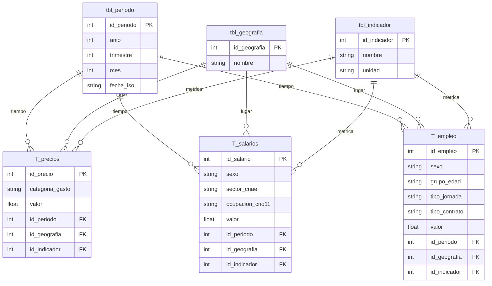
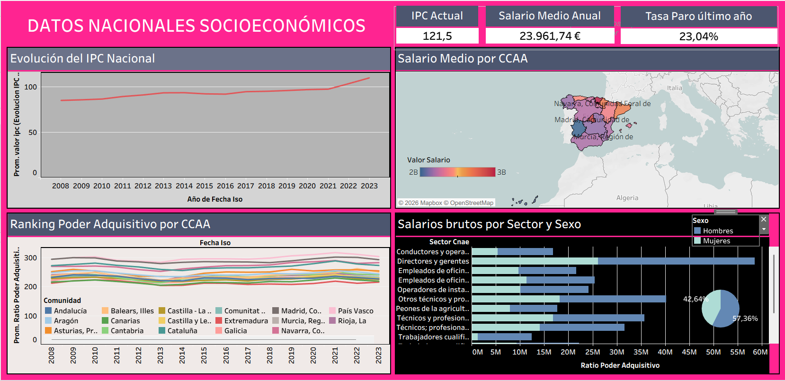
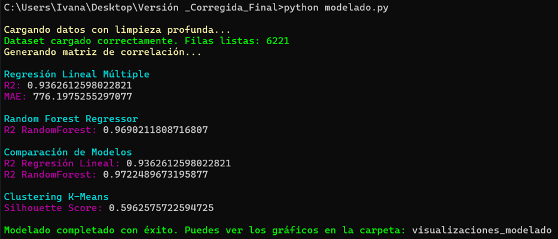
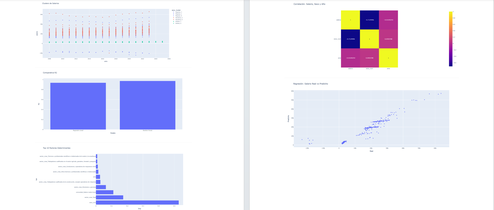
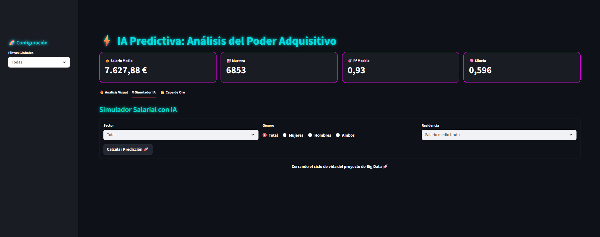

# 📈 Análisis de la Evolución del Poder Adquisitivo en España

## 🎯 Objetivo del Proyecto

El objetivo principal de este proyecto es analizar la evolución del poder adquisitivo de la clase trabajadora en España mediante un sistema automatizado de **Ingeniería de Datos**.

El proyecto implementa un proceso **ETL (Extract, Transform, Load)** que recopila, limpia y cruza datos macroeconómicos clave para establecer relaciones entre:
1.  **Calidad del empleo** (Tasa de paro y temporalidad).
2.  **Remuneración real** (Salarios de coyuntura y estructurales).
3.  **Coste de vida** (Inflación IPC y precio de la vivienda IPV).

El sistema permite desglosar la información por **Comunidades Autónomas**, sectores de actividad y grupos socioeconómicos, superando el análisis de medias simples.

---

## 📊 Fuentes de Datos (INE - API JSON-stat)

El proyecto se alimenta de fuentes oficiales del **Instituto Nacional de Estadística (INE)** mediante peticiones automatizadas a su API. A continuación se enlazan las tablas originales utilizadas:

### 1. Gasto y Coste de Vida
* **[IPC - Índice de Precios de Consumo (Tabla 50913)](https://www.ine.es/jaxiT3/Tabla.htm?t=50913):** Se extrae el índice general, variación anual y categorías clave (Alimentos, Transporte, Energía) para medir la inflación real.
* **[IPV - Índice de Precios de Vivienda (Tabla 25171)](https://www.ine.es/jaxiT3/Tabla.htm?t=25171):** Evolución del precio de compra de vivienda (Índice general y variación anual).

### 2. Ingresos y Salarios
* **[ETCL - Encuesta Trimestral de Coste Laboral (Tabla 6061)](https://www.ine.es/jaxiT3/Tabla.htm?t=6061):** Datos trimestrales sobre el *Coste Salarial* bruto (filtrando costes de seguridad social).
* **EAES - Encuesta Anual de Estructura Salarial:** Datos estructurales para medir la desigualdad.
    * *[Ganancia por trabajador (Tabla 28191)](https://www.ine.es/jaxiT3/Tabla.htm?t=28191):* Media, Mediana, Deciles 10 y Cuartil inferior.
    * *[Ganancia por ocupación (Tabla 28186)](https://www.ine.es/jaxiT3/Tabla.htm?t=28186):* Salarios desglosados por tipo de trabajo.

### 3. Empleo
* **[EPA - Tasa de Paro (Tabla 65334)](https://www.ine.es/jaxiT3/Tabla.htm?t=65334):** Tasa de paro (desglosada por sexo y edad).
* **[Asalariados por tipo de contrato (Tabla 65132)](https://www.ine.es/jaxiT3/Tabla.htm?t=65132):** Datos de asalariados totales vs. temporales (filtrados por jornada total) para calcular la tasa de temporalidad real.

---

## 🗄️ Arquitectura de Datos (Star Schema)

Se ha diseñado una base de datos **SQLite3** siguiendo un **Modelo en Estrella (Star Schema)**. Esta arquitectura separa las *dimensiones* (tablas de búsqueda) de las *tablas de hechos* (datos numéricos), optimizando el análisis posterior.

### Estructura Relacional
La base de datos se organiza en torno a tres tablas centrales de hechos que comparten las mismas dimensiones para facilitar el cruce de datos:

**Tablas de Dimensiones (Lookups):**
* **`tbl_periodo`**: Tabla maestra de tiempo. Normaliza frecuencias mensuales (IPC), trimestrales (EPA) y anuales (EES).
* **`tbl_geografia`**: Comunidades Autónomas y Total Nacional.
* **`tbl_indicador`**: Catálogo unificado de variables (ej: "IPC_General", "Salario_Mediana", "Tasa_Paro").

**Tablas de Hechos (Facts):**
| Tabla | Descripción | Desglose / Segmentación |
| :--- | :--- | :--- |
| **`T_precios`** | Unifica IPC e IPV. | `categoria_gasto` (Alimentos, Vivienda...) |
| **`T_salarios`** | Unifica ETCL y EES. | `sector_cnae`, `ocupacion_cno11`, `sexo` |
| **`T_empleo`** | Unifica Paro y Temporalidad. | `grupo_edad`, `tipo_contrato`, `tipo_jornada` |


```mermaid
erDiagram
    %% --- DIMENSIONES (Tablas Maestras) ---
    tbl_periodo {
        int id_periodo PK
        int anio
        int trimestre
        int mes
        string fecha_iso
    }
    tbl_geografia {
        int id_geografia PK
        string nombre
    }
    tbl_indicador {
        int id_indicador PK
        string nombre
        string unidad
    }

    %% --- HECHOS (Tablas de Datos) ---
    T_precios {
        int id_precio PK
        string categoria_gasto
        float valor
        int id_periodo FK
        int id_geografia FK
        int id_indicador FK
    }
    T_salarios {
        int id_salario PK
        string sexo
        string sector_cnae
        string ocupacion_cno11
        float valor
        int id_periodo FK
        int id_geografia FK
        int id_indicador FK
    }
    T_empleo {
        int id_empleo PK
        string sexo
        string grupo_edad
        string tipo_jornada
        string tipo_contrato
        float valor
        int id_periodo FK
        int id_geografia FK
        int id_indicador FK
    }

    %% --- RELACIONES (Star Schema) ---
    tbl_periodo ||--o{ T_precios : "tiempo"
    tbl_periodo ||--o{ T_salarios : "tiempo"
    tbl_periodo ||--o{ T_empleo : "tiempo"

    tbl_geografia ||--o{ T_precios : "lugar"
    tbl_geografia ||--o{ T_salarios : "lugar"
    tbl_geografia ||--o{ T_empleo : "lugar"

    tbl_indicador ||--o{ T_precios : "metrica"
    tbl_indicador ||--o{ T_salarios : "metrica"
    tbl_indicador ||--o{ T_empleo : "metrica"
```

---

## ⚙️ Arquitectura y Flujo del Proceso ETL

Este proyecto se ha construido siguiendo una arquitectura modular y orientada a objetos (OOP), diseñada para facilitar el mantenimiento, la escalabilidad y la trazabilidad del dato.

### 1. Estructura de Ficheros
El código se organiza separando claramente la configuración, la lógica de negocio y el acceso a datos:

```text
📁 Proyecto
├── 📄 main.py            # Orquestador: Inicia conexión y ejecuta el bucle ETL.
├── 📁 config
│   └── 📄 constantes.py  # Códigos ID de las tablas API del INE.
├── 📁 src
│   ├── 📄 db.py          # Patrón Singleton para conexión y creación de esquema.
│   ├── 📄 inedata.py     # EXTRACT: Clase para conexión HTTP y descarga JSON.
│   ├── 📄 procesar.py    # TRANSFORM: Limpieza, filtrado y lógica de negocio.
│   └── 📄 almacenar.py   # LOAD: Inserción masiva con control de duplicados.
└── 📄 proyecto_datos.db  # Base de datos resultante.
```


### 2. Detalle del Proceso ETL

El núcleo del proyecto es un pipeline automatizado que gestiona el ciclo de vida de los datos desde la API del INE hasta la base de datos analítica. El proceso se divide en tres etapas controladas por el orquestador `main.py`:

#### 1. Extracción (`src/inedata.py`)
* Conexión HTTP robusta con la API **JSON-stat** del INE.
* Gestión de errores de conexión y tiempos de espera (timeout).
* Descarga de series temporales completas en formato crudo (raw data).

#### 2. Transformación (`src/procesar.py`)
Es la etapa más compleja, donde se aplica la lógica de negocio para asegurar la calidad del dato:
* **Parsing de Metadatos:** Se descomponen las cadenas de texto del INE (ej: *"Total Nacional. Industria. Coste..."*) para extraer dimensiones limpias (Geografía, Sector, Sexo).
* **Filtrado de Salarios:** Se discrimina entre *"Coste Laboral"* y *"Coste Salarial"*, conservando únicamente este último (salario bruto) para reflejar la remuneración real del trabajador.
* **Lógica de Empleo:** Se filtran los datos de jornada parcial para calcular la **Temporalidad** basándose exclusivamente en contratos de jornada completa (comparando *Total Asalariados* vs *Temporales*).
* **Normalización del IPC:** Se agrupan y renombran las categorías de gasto (Alimentos, Vivienda, Transporte) para facilitar consultas SQL posteriores.

#### 3. Carga (`src/almacenar.py`)
* **Enrutamiento Inteligente:** El sistema detecta automáticamente a qué tabla de hechos (`T_precios`, `T_salarios`, `T_empleo`) deben ir los datos según su código de origen.
* **Gestión de Integridad:** Uso de sentencias `INSERT OR IGNORE` combinadas con claves únicas compuestas (`UNIQUE`) en la base de datos. Esto permite re-ejecutar el script tantas veces como sea necesario sin generar registros duplicados.

---

## 🚀 Instalación y Uso

Sigue estos pasos para desplegar el proyecto en tu entorno local:

### 1. Clonar el repositorio
Descarga el código fuente desde GitHub:
```bash
git clone https://github.com/Alebernabe5/Act1.7-ObtencionYAlmacenamiento
cd Act1.7-ObtencionYAlmacenamiento
```

### 2. Configurar el entorno virtual
Es recomendable usar un entorno virtual para aislar las dependencias:
* **En macOS / Linux**:
    ```bash
    python3 -m venv .venv
    source .venv/bin/activate
    ```
* **En Windows**:
    ```bash
    python -m venv .venv
    .venv\Scripts\activate
    ```

### 3. Instalar dependencias
El proyecto es ligero y solo requiere la librería `requests` para las peticiones a la API:
```bash
pip install requests
```

### 4. Ejecutar el ETL
Lanza el script principal. No es necesario configurar la base de datos previamente; el script la creará si no existe.
```bash
python main.py
```

**Resultado esperado:** Verás en la terminal el progreso de procesamiento tabla por tabla. Al finalizar, se habrá generado un archivo `proyecto_datos.db` en la raíz del proyecto con todos los datos actualizados.

---

## 🚀 Fase 2: Procesamiento Big Data y Análisis Visual

En esta etapa final, el proyecto evoluciona de la recolección masiva al Análisis Avanzado de Datos (Capa de Oro). Se ha implementado un motor de alto rendimiento para cruzar las variables económicas y generar conocimiento accionable.

## 🛠️ Tecnologías de Análisis de Alto Rendimiento
Polars (Core Engine): Motor de procesamiento de datos extremadamente rápido escrito en Rust. Se utiliza para manejar los más de 200,000 registros de la base de datos de forma eficiente mediante procesamiento multihilo.
Plotly Express: Librería empleada para la creación de gráficos interactivos que permiten explorar tendencias y correlaciones directamente en archivos HTML.
PyArrow: Motor de Big Data utilizado para la exportación de archivos en formato Parquet, optimizando el almacenamiento y la velocidad de lectura.

## ⚙️ Guía de Configuración e Instalación
Para ejecutar el análisis de Big Data desde cero y evitar errores de dependencias o versiones, sigue estos pasos:
1.Crear y activar el entorno virtual:
PowerShell

```bash
python -m venv .venv
.\.venv\Scripts\activate
```

Nota: Si PowerShell bloquea el script de activación, ejecuta: Set-ExecutionPolicy -ExecutionPolicy RemoteSigned -Scope Process

2.Instalar el Stack de Big Data:

```bash
pip install polars plotly pyarrow pandas numpy
```

3.Ejecutar el motor de análisis:


```bash
 python analisis_bigdata.py 
```

## 📊 Análisis de la "Capa de Oro"
El script `analisis_bigdata.py` realiza transformaciones críticas para convertir datos en bruto en indicadores de valor:

1. **Cálculo del Poder Adquisitivo**: Se ha creado una métrica personalizada cruzando salarios brutos e inflación (IPC).
   $$ratio\_poder\_adquisitivo = \frac{valor\_salario}{valor\_ipc}$$
2. **Normalización por Medias**: Para garantizar una comparativa justa entre sectores con distintos volúmenes de datos, se aplica la **media aritmética** sobre el ratio de poder adquisitivo y el salario nominal.
3. **Correlación Multi-variable**: Cruce de la tasa de paro (EPA) con niveles salariales y género para detectar desigualdades estructurales.

## 📈 Interpretación de Resultados Visuales

### 1. [📈 Evolución IPC General](./visualizaciones/1_evolucion_ipc.png)
Gráfico de línea con marcadores que identifica la aceleración inflacionista desde 2021.

### 2. [📊 Tendencia del Salario Medio por CCAA](./visualizaciones/2_salario_comunidades.png)
Representación de la **media salarial anual** por comunidad autónoma. Permite observar que Madrid y País Vasco mantienen un crecimiento sostenido por encima de la media nacional.

### 3. [👥 Ranking de Poder Adquisitivo Medio por Sector](./visualizaciones/3_poder_adquisitivo_evolutivo.png)
Este gráfico de barras horizontales representa el **promedio histórico** del periodo seleccionado, permitiendo una interpretación clara de la jerarquía económica:
* **Estabilidad Estadística**: Al utilizar la **media del poder adquisitivo**, se eliminan fluctuaciones estacionales, ofreciendo una visión robusta de qué sectores son estructuralmente más rentables.
* **Brecha de Género en Medias**: Se observa que la **media** del ratio en hombres (Morado) es sistemáticamente superior a la de las mujeres (Turquesa) en sectores de alta cualificación.
* **Liderazgo Directivo**: La media de "Directores y gerentes" destaca como un outlier positivo, consolidando su posición como el sector con mayor capacidad de compra real.


## 📂 Salida de Datos y Formatos de Big Data
Tras la ejecución del análisis, se generan datasets finales en la carpeta data_output/:

   - Evolucion_IPC_Nacional.csv: Histórico limpio de precios.
   - Salarios_por_Sector.csv: Resumen de remuneraciones por sector CNAE.
   - Relacion_Paro_Salarios.csv: Dataset cruzado para análisis de mercado laboral
   - .Evolucion_IPC_Nacional.parquet: Exportación en formato de columnas optimizado para entornos de alto rendimiento.

## 🚀 Ejercicios Extras

Los ejercicios complementarios se encuentran organizados de la siguiente manera:

* **Rama:** `FormatosBigDataParquet`
* **Commits clave:**
    * `c8090a5`: Solucion Parquet
    * `3c29d79`: Implementación de Polar VS Pandas.
    * `2070fb1`: Implementación de dashboard.

---

## 🎨 Fase 3: Explotación de Datos y Business Intelligence (Tableau)

En esta etapa final, hemos migrado el análisis desde el procesamiento programático hacia una herramienta de **Business Intelligence (BI)** profesional. El objetivo es permitir que el usuario final interactúe con los datos y extraiga conclusiones de forma visual.

### 🔌 Conexión Híbrida de Datos
Se ha implementado una arquitectura de datos mixta dentro de Tableau:
* **Archivos Estáticos (Capa de Oro):** Conexión a los archivos CSV procesados previamente con Polars para el análisis de tendencias.
* **Modelado de Datos:** Se han relacionado las tablas mediante campos clave como `fecha_iso`, `sexo` y `comunidad`, permitiendo cruces de información entre el IPC y los niveles salariales sobre un volumen de más de 5 millones de registros.

### 📊 Cuadro de Mando Interactivo (Dashboard)


El dashboard diseñado ofrece una narrativa coherente dividida en los siguientes puntos clave:

1.  **Visión Macroeconómica (KPIs):**
    * Ubicados en la parte superior, muestran los valores actuales de **IPC (121,5)**, **Salario Medio (23.961,74€)** y **Tasa de Paro (23,04%)**. Permiten al usuario situarse en el contexto económico actual de un vistazo.

2.  **Distribución Geográfica (Mapa de Calor):**
    * **Función:** Representa el ranking de salarios por Comunidad Autónoma.
    * **Insight:** Facilita la identificación visual inmediata de las regiones con mayor y menor nivel retributivo, superando la limitación de las tablas de datos planas.

3.  **Evolución Histórica (Gráfico de Líneas):**
    * **Métrica:** Índice de precios (IPC) a lo largo del tiempo (2008-2023).
    * **Importancia:** Crucial para identificar los puntos de inflexión inflacionista y cómo el coste de vida ha escalado frente a la estabilidad de otros indicadores.

4.  **Estructura Sectorial (Gráfico de Barras Agrupadas):**
    * **Ejes:** Sector CNAE vs Salario Bruto.
    * **Detalle:** Este gráfico desglosa la remuneración por tipo de actividad, permitiendo comparar, por ejemplo, el sector servicios frente a la industria.

5.  **Proporción de Masa Salarial (Gráfico Circular Flotante):**
    * **Análisis de Género:** Actúa como una capa de información secundaria que desglosa el porcentaje total de salarios repartido entre hombres (**57,36%**) y mujeres (**42,64%**).
    * **Integración:** Se ha configurado con fondo transparente para que flote sobre el análisis sectorial, permitiendo una comparativa directa entre la ocupación y la retribución por sexo.

### ⚙️ Configuración del Modelo de Datos
Para que todos estos gráficos funcionen de forma sincronizada, se configuró la tarjeta de **Marcas** y el panel de **Filtros** de la siguiente manera:
* **Sincronización:** Se establecieron relaciones basadas en `fecha_iso` y `comunidad` para que, al filtrar por una región en el mapa, el resto de gráficos (IPC y Salarios) se actualicen automáticamente.
* **Cálculos Dinámicos:** Se implementaron cálculos de tabla rápidos para transformar valores absolutos de salario en porcentajes de contribución en el gráfico circular.

### 📸 Resultado Final en Tableau. Visualización interactiva
Puedes explorar el análisis completo, navegar por los mapas y filtrar por provincias en el siguiente enlace:

👉 **[Ver Dashboard: Análisis del Poder Adquisitivo en España](https://public.tableau.com/app/profile/ivana.s.nchez.p.rez/viz/IPC_Tableau/Dashboard?publish=yes)**

---

## 🧠 Fase 4: Inteligencia Artificial y Modelado Predictivo

En esta última etapa el proyecto evoluciona desde el análisis descriptivo hacia el **modelado predictivo mediante técnicas de Machine Learning**.  
El objetivo es identificar patrones ocultos en los datos económicos y evaluar qué variables explican mejor la evolución salarial en España.

A partir del dataset consolidado en la base de datos `SQLite`, se ha construido un pipeline de análisis que permite **predecir salarios, analizar correlaciones estructurales y segmentar grupos socioeconómicos**.

---

## 🤖 Modelos de Machine Learning Implementados

Para obtener una visión completa del fenómeno salarial se han utilizado tres enfoques distintos de aprendizaje automático. Para optimizar el rendimiento, se realizó un ajuste de hiperparámetros en el modelo Random Forest (aumentando a 200 árboles y controlando la profundidad) para evitar el sobreajuste.

### 1. Regresión Lineal Múltiple (Supervisado)

Se aplica un modelo de **regresión lineal múltiple** para estimar la relación entre el salario y diferentes variables explicativas.

Variables utilizadas:

- Año
- Sexo
- Sector profesional (CNAE)

Este modelo permite medir **relaciones directas entre variables** y sirve como referencia inicial para evaluar modelos más complejos.

---

### 2. Random Forest Regressor (Ensemble Learning)

Se ha implementado un modelo **Random Forest**, basado en múltiples árboles de decisión.

Este algoritmo es capaz de:

- Captar **relaciones no lineales**
- Reducir el sobreajuste
- Calcular la **importancia relativa de cada variable**

Gracias a este modelo se puede identificar **qué factores influyen más en el salario** dentro del dataset.

---

### 3. Clustering K-Means (Aprendizaje No Supervisado)

Además del modelado predictivo se ha aplicado **clustering K-Means** para detectar patrones en la distribución salarial.
Para evaluar la calidad del agrupamiento se utilizó el índice de Silhouette, que mide la separación entre clusters y la cohesión interna de cada grupo.

Este algoritmo permite:

- Agrupar trabajadores según **niveles salariales similares**
- Identificar **segmentos socioeconómicos**
- Analizar cómo evolucionan los grupos salariales a lo largo del tiempo

---

## 🛠️ Ingeniería de Características (Feature Engineering)

Antes de entrenar los modelos fue necesario preparar el dataset mediante varias transformaciones.

### Codificación de Variables Categóricas

Las variables categóricas se transformaron en formato numérico mediante:

- **One-Hot Encoding** para `sector_cnae`
- **Codificación binaria** para `sexo`

Esto permite que los algoritmos de Machine Learning puedan interpretar correctamente estas variables.

---

### Limpieza y filtrado de datos

Durante el proceso de preparación del dataset se aplicaron varias reglas de calidad:

- Eliminación de registros agregados (`Total`)
- Eliminación de valores nulos
- Normalización de formatos temporales

El resultado fue un dataset limpio con aproximadamente **1.642 registros maestros**, adecuado para modelado estadístico.

---

## 📊 Resultados del Modelado Predictivo






El script `modelado.py` genera automáticamente una batería de visualizaciones que permiten evaluar el comportamiento de los modelos y la estructura de los datos.

---

## 📈 Interpretación de Resultados

### 1. Capacidad Predictiva del Modelo (R²)

La inclusión de variables estructurales como el **sector profesional** y el **sexo** mejora significativamente la capacidad explicativa del modelo.

El modelo alcanza valores de:

**R² ≈ 0.93 (Regresión Lineal)
**R² ≈ 0.97 (Random Forest)

Esto indica que aproximadamente entre el 93% y el 97% de la variabilidad salarial puede explicarse mediante las variables incluidas en el modelo.  
Podemos decir que se trata de un modelo de alta fidelidad que demuestra que el salario es altamente predecible según el sector y el género.

---

### 2. Factores Determinantes del Salario

El análisis de **importancia de variables** obtenido mediante Random Forest muestra que los factores más relevantes son:

1. **Sector profesional**
2. **Sexo**
3. **Evolución temporal (año)**

Este resultado sugiere que la estructura del mercado laboral tiene un impacto significativo en la remuneración, además de confirmar la persistencia de la brecha salarial como una variable de alto impacto en la predicción.

---

### 3. Error Medio de Predicción (MAE)

El modelo presenta un **Error Absoluto Medio (MAE)** aproximado de:

**MAE ≈ 776,19 €**

Esto significa que la diferencia media entre el salario real y el predicho es mínima. Considerando la diversidad de sueldos en el dataset, este margen permite realizar estimaciones salariales sumamente fiables.

---

### 4. Calidad del Clustering (Silhouette Score)

Se obtuvo un **Silhouette Score de 0.596**. Este valor confirma que los grupos salariales identificados están bien definidos y separados, validando la existencia de "escalones" salariales rígidos dentro del mercado laboral que el modelo ha sabido captar.

---

## ⚙️ Ejecución del Modelado Predictivo

Para ejecutar el pipeline de Machine Learning desde cero:

### 1. Instalar dependencias

```bash
pip install scikit-learn statsmodels plotly polars pandas numpy

```
## 🎨 Fase 5: Implementación del Dashboard Interactivo y UX (Streamlit)

En esta fase final, se ha consolidado todo el ecosistema de datos en una aplicación web interactiva diseñada para la toma de decisiones y la exploración de predicciones salariales mediante herramientas de Business Intelligence y Machine Learning.

### 🏗️ Estructura y Maquetación
Se ha diseñado una interfaz de **alto contraste (Dark Mode)** con una disposición modular para facilitar la navegación. El panel se organiza mediante una **Barra Lateral de Control** para filtros globales (Comunidad Autónoma) y un sistema de **Pestañas (Tabs)** para separar las diferentes áreas de análisis:
* **Análisis Visual:** Gráficos de tendencias estructurales.
* **Simulador IA:** Interfaz de entrada para el modelo predictivo.
* **Capa de Oro:** Acceso directo al dataset final y exportación.

### 📊 Integración de Datos y Gráficos
Se han integrado visualizaciones dinámicas utilizando la librería **Plotly Express**, sincronizadas con el motor de alto rendimiento **Polars** para garantizar una respuesta instantánea.
* **Sueldo Medio por Sector:** Gráfico de barras horizontales que permite identificar rápidamente los sectores más lucrativos del mercado laboral.
* **Análisis de Brecha de Género:** Visualización comparativa que expone las desigualdades retributivas por tipo de actividad CNAE.
* **Tabla Interactiva:** En la pestaña "Capa de Oro", el usuario puede explorar los registros maestros utilizados para el entrenamiento del modelo.

> 
> *Vista general del Análisis Visual y KPIs del proyecto.*

### 🤖 Implementación del Modelo Predictivo
Se ha desplegado el modelo **Random Forest Regressor** ($R^2 \approx 0.97$) mediante un simulador en tiempo real integrado en la interfaz.
* **Input de Usuario:** El panel permite introducir variables categóricas: Sector Profesional, Género y Comunidad Autónoma.
* **Predicción Instantánea:** El sistema procesa la entrada a través del pipeline de ML y devuelve una estimación salarial bruta anual con una alta fidelidad estadística.

> 
> *Interfaz del simulador predictivo basado en Machine Learning.*

### 💎 Refinamiento de la UX (Experiencia de Usuario)
Para dotar al proyecto de un acabado profesional y coherente con el análisis de Big Data, se han aplicado las siguientes mejoras:
* **Identidad Visual:** Uso de logotipos y tipografías neón (Fucsia/Turquesa) para una estética moderna y tecnológica.
* **Métricas Clave (KPIs):** Visualización superior de indicadores críticos como Salario Medio, Tamaño de la Muestra y métricas de calidad del modelo ($R^2$ y Silhouette).
* **Estilo Gemelo:** Unificación visual de componentes (botones de predicción y descarga) para una interfaz equilibrada y legible.
* **Optimización de Gráficos:** Ajuste de márgenes y eliminación de ruido visual (ModeBar) para maximizar la legibilidad de las etiquetas CNAE.ç
  
```

## 🤝 Colaboradores

* Alejandro Bernabé Guerrero -> https://github.com/Alebernabe5
* Ivana Sánchez Pérez -> https://github.com/Ivanasp43


